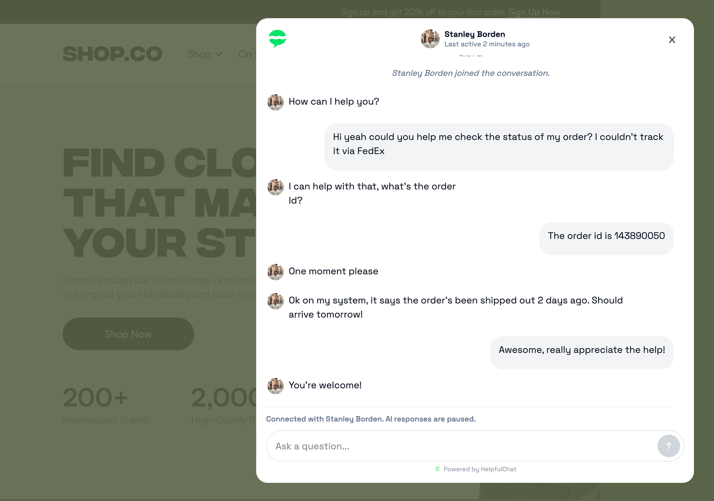

OpenChatWidget lets you embed a ChatGPT-like AI chat experience into your website. Build your own AI agent and customize the chat UI. You own the entire experience. It's free, open source, and self hosted. You own the entire stack. 

If you want to bring agentic chat to your product, this is it. Get started with only a few lines of code. 

### Example use cases

- **AI customer service agent**
  Help customers get instant answers, resolve common support questions, and reduce ticket volume. Open source free alternative to Intercom's Fin Agent.
- **Knowledge base and documentation search**
  Let users ask questions about your docs, product guides, or internal knowledge base in natural language.
- **In-product onboarding**
  Add a chat assistant that helps users navigate your dashboard, learn features, and get unstuck faster.
- **Bookings and task automation**
  Power flows like scheduling meetings, tracking orders, booking appointments, and triggering simple actions.

## 🚀 Quick Start

Install the widget in your React app:

```bash
npm install openchatwidget
```

Embed the component anywhere in your project. A common pattern is to mount it in your main app layout so it appears across your site.

```tsx
import { OpenChatWidget } from "openchatwidget";

export default function App() {
  return (
    <>
      <main>
        <h1>Your Landing Page</h1>
        ...
      </main>

      <OpenChatWidget url="<YOUR_AGENT_STREAMING_ENDPOINT>" />
    </>
  );
}
```

The next step is to set up your AI agent backend. Create an API endpoint with your favorite Node backend framework, such as Express or Hono.

For a working Express backend example, see [`examples/vite-express-app/server`](./examples/vite-express-app/server/index.ts).

## ✨ Features

| Feature | Details |
| --- | --- |
| Embeddable widget | Add a bottom-right AI chat widget to any React / Next app with a single component. |
| Build your own agent | Create your own AI agent hosted on any Node backend framework |
| 🚧 Support for voice and image uploading |  Be able to talk to engage and upload photos in the chat widget |
| 🚧 Support for MCP and MCP apps | Connect to MCP servers and render UI from MCP apps  |
| 🚧 Client side tools |  Be able to call tools on the client side |



## 📦 Examples

- [`examples/vite-express-app`](./examples/vite-express-app): Vite frontend with an Express backend and OpenAI streaming


## 🛣️ Roadmap

TBD
## 🤝 Community

OpenChatWidget is early and intentionally focused.

If you want to help shape it:

- open an issue: [GitHub Issues](https://github.com/Open-Chat-Widget/openchatwidget/issues)
- open a pull request: [GitHub Pull Requests](https://github.com/Open-Chat-Widget/openchatwidget/pulls)
- read the guide: [CONTRIBUTING.md](./CONTRIBUTING.md)

## 📄 License

MIT. See [LICENSE](./LICENSE).
