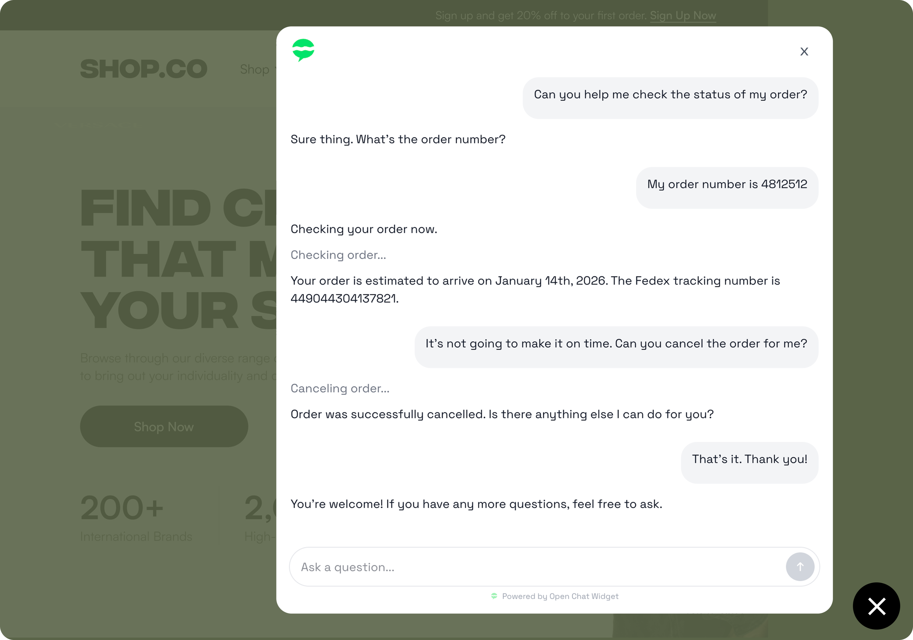

<div align="center">
  

  <p>
    <a href="https://www.npmjs.com/package/@openchatwidget/sdk">
      
    </a>
    <a href="./LICENSE">
      
    </a>
    <a href="https://discord.gg/jA4vcJKECy">
      
    </a>
  </p>
</div>

Open Chat Widget lets you embed a ChatGPT-like AI chat assistant into your site. Use it for customer service (free Intercom Fin alternative), knowledge base / documentation search, onboarding assistant, and more. Build great AI chat experiences for your users.  

- **Drop-in ease** - One component for feature-rich AI chat that works out of the box. Minimal set up required.

- **Bring your own agent** — Build custom agents with Vercel AI SDK. Point the widget at your agent streaming endpoint. Works with existing AI SDK agents. 

- **Framework-agnostic** — React, Next.js, Vue, WordPress, Shopify, Wix. Plugs in to any web framework or website platform.

- **Open source** — MIT licensed. Free forever. You own your data and infrastructure. 

<div align="center">
  
</div> 

## 🚀 Quick Start (React / Next.js)

### Step 1: Install the SDK
Install the widget in your React app:

```bash
npm install @openchatwidget/sdk
```

Then embed the component anywhere in your project. A common pattern is to mount it in your main app layout so it appears across your site.

```tsx
import { OpenChatWidget } from "@openchatwidget/sdk";

export default function MySite() {
  return (
    <>
      ...
      <OpenChatWidget url="<YOUR_AGENT_STREAMING_ENDPOINT>" /> 
    </>
  );
}
```

<details>
<summary><span style="font-size: 1.25em; font-weight: 600;">Step 2: Build an AI agent</span></summary>
The next step is to set up your AI agent backend. Create an API endpoint with your favorite Node backend framework, such as Express or Hono.

Here's a simple text stream agent: 
```tsx
app.use(express.json());
app.post("/api/chat", async (request, response) => {
  const { messages } = request.body as { messages: UIMessage[] };

  const openai = createOpenAI({
    apiKey: process.env.OPENAI_API_KEY,
  });

  const result = streamText({
    model: openai("gpt-4o-mini"),
    system: "You are the OpenChatWidget example assistant. Keep answers concise and useful.",
    messages: await convertToModelMessages(messages),
  });

  result.pipeUIMessageStreamToResponse(response);
});
```
</details>

<details>
<summary><span style="font-size: 1.25em; font-weight: 600;">Step 3: Connect widget to agent</span></summary>

Paste the streaming URL endpoint into the `<OpenChatWidget />` UI component:

```tsx
<OpenChatWidget url="http://localhost:8787/api/chat" /> 
```

You should now be ready to chat!
</details> 

## Examples
We've included some examples of Open Chat Widget installed in web app projects as reference: 


- [`examples/vite-express-app`](./examples/vite-express-app): Open Chat Widget installed in a React + Vite frontend with an Express backend. 
- [`examples/nextjs-landing-page`](./examples/nextjs-landing-page): Open Chat Widget installed on a Next.js app with API Routes. This is the live landing page too. 

## Roadmap

[See ROADMAP.md](./ROADMAP.md)

## 🤝 Community

- [Discord](https://discord.gg/jA4vcJKECy)
- [CONTRIBUTING.md](CONTRIBUTING.md)

## 📄 License

Open Source MIT. See [LICENSE](./LICENSE).
